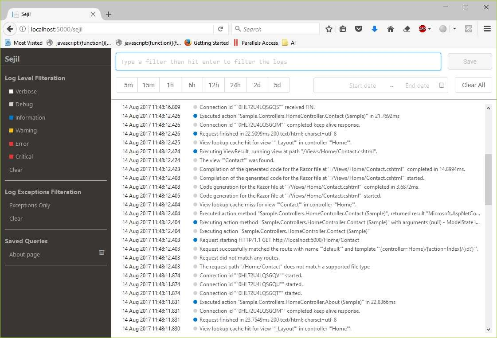
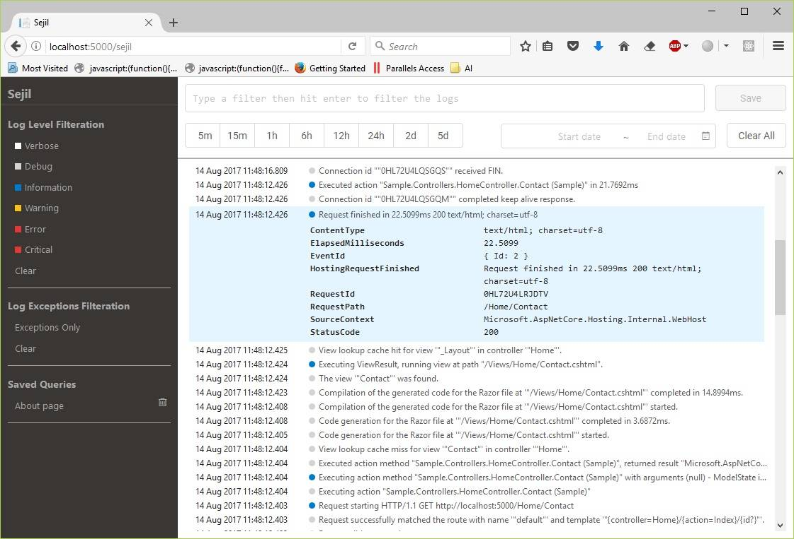
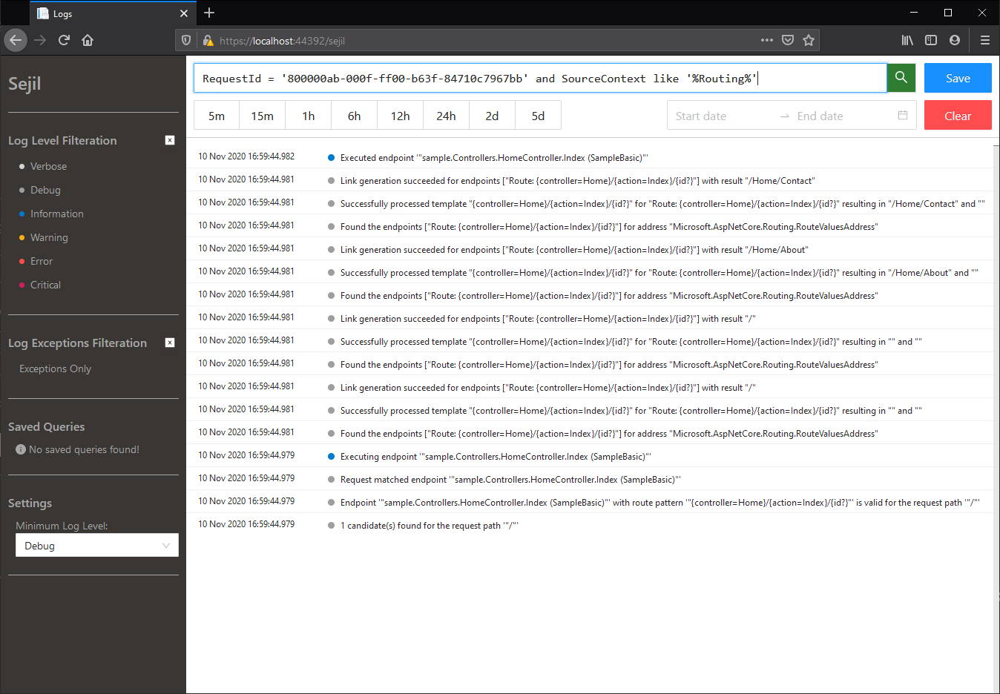
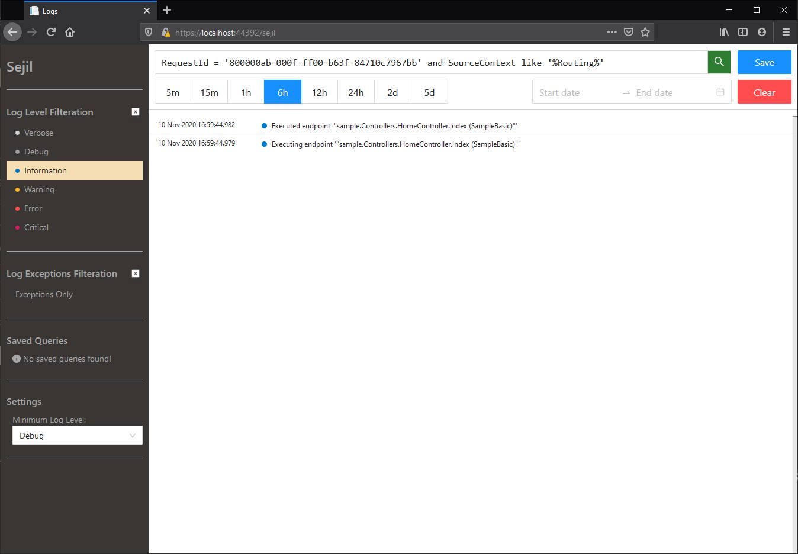
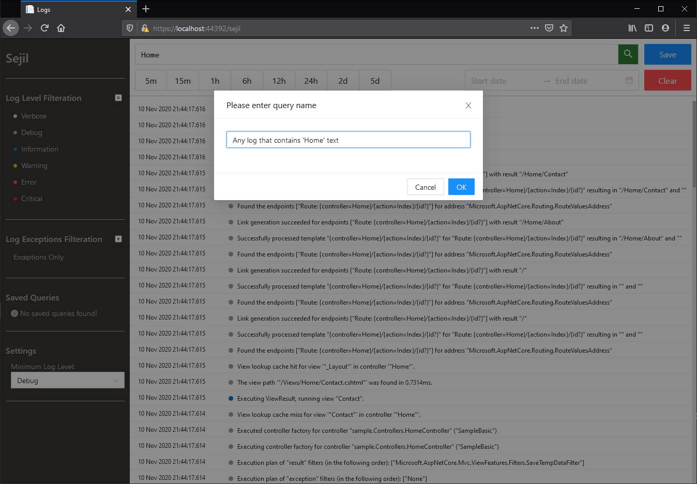
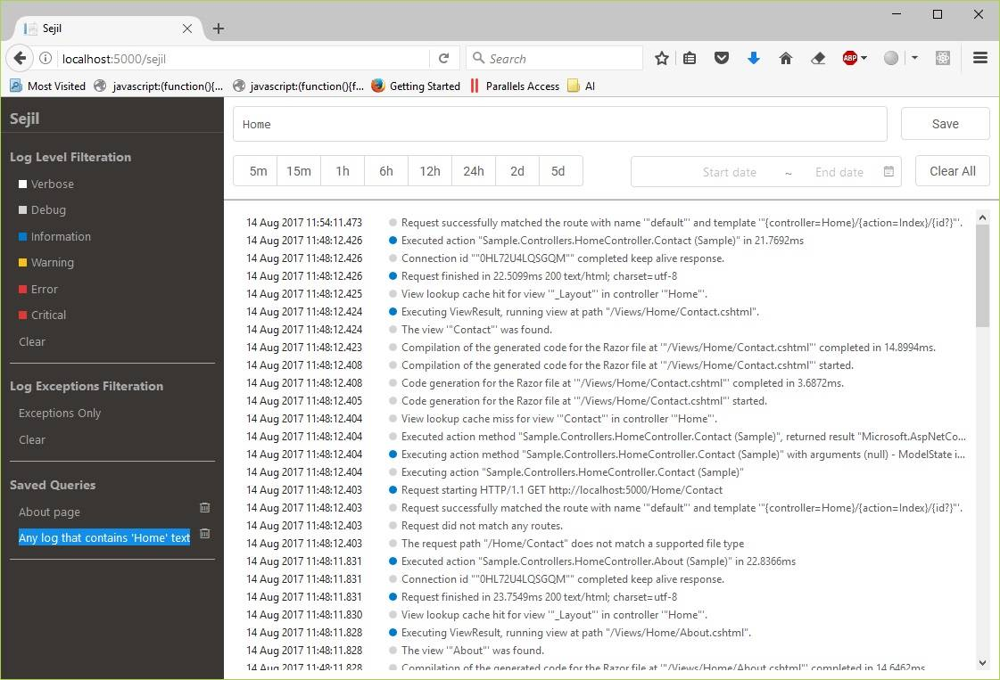

# Sejil

[](https://ci.appveyor.com/project/alaatm/sejil)
[](https://www.nuget.org/packages/Sejil/)

Sejil is a library that enables you to capture, view and filter your ASP.net core app's log events right from your app. It supports structured logging, querying as well as saving log event queries.

## Quick Links

- [Getting started](#getting-started)
- [Features and Screenshots](#features-and-screenshots)
- [Building](#building)
- [License](#license)

## Getting started

1. Installing [Sejil](https://www.nuget.org/packages/Sejil/) package

    ```powershell
    dotnet add package Sejil --version 1.0.0-beta8
    ```

2. Adding code

    For ASP.net Core 1.x.x, add below code to **Program.cs**:

    ```csharp
    public static void Main(string[] args)
    {
        var host = new WebHostBuilder()
            .AddSejil("/sejil", LogLevel.Debug)
            // ...
    }
    ```

    For ASP.net core 2.x.x, add below code to **Program.cs**:

    ```csharp
    public static IWebHost BuildWebHost(string[] args) =>
        WebHost.CreateDefaultBuilder(args)
            .AddSejil("/sejil", LogLevel.Debug)
            // ...
    ```

    Add below code to **Startup.cs**

    ```csharp
    using Sejil;

    public class Startup
    {    
        public void Configure(IApplicationBuilder app, IHostingEnvironment env)
        {
            app.UseSejil();
            // ...
        }
    }
    ```

    (Optional) To require authentication for viewing logs:

    ```csharp
        public void ConfigureServices(IServiceCollection services)
        {
            services.ConfigureSejil(options =>
            {
                options.AuthenticationScheme = /* Your authentication scheme */
            });
        }
    ```

    (Optional) To change the logs page title (Defaults to *Sejil* if not set):

    ```csharp
        public void ConfigureServices(IServiceCollection services)
        {
            services.ConfigureSejil(options =>
            {
                options.Title = "My title";
            });
        }
    ```

3. Navigate to *http://your-app-url/sejil* to view your app's logs.

## Features and Screenshots

- View your app's logs

    

- View properties specific to a certain log entry

    

- Query your logs

    

- Mix multiple filters with your query to further limit the results

    

- Save your queries for later use

    

- Load your saved queries

    

## Building

To build the project, you just need to clone the repo then run the build command:

```powershell
git clone https://github.com/alaatm/Sejil.git
cd ./Sejil
./build.ps1  # If running Windows
./build.sh   # If running Linux/OSX
```

You can run one of the sample apps afterwards, `Sample1.0` targets `netcoreapp1.1` while `Sample2.0` targets `netcoreapp2.0`:

```powershell
cd ./sample/Sample2.0
dotnet run
```

## License

[](https://opensource.org/licenses/Apache-2.0)

Copyright &copy; Alaa Masoud.

This project is provided as-is under the Apache 2.0 license. For more information see the [LICENSE file](https://github.com/alaatm/Sejil/blob/master/LICENSE).